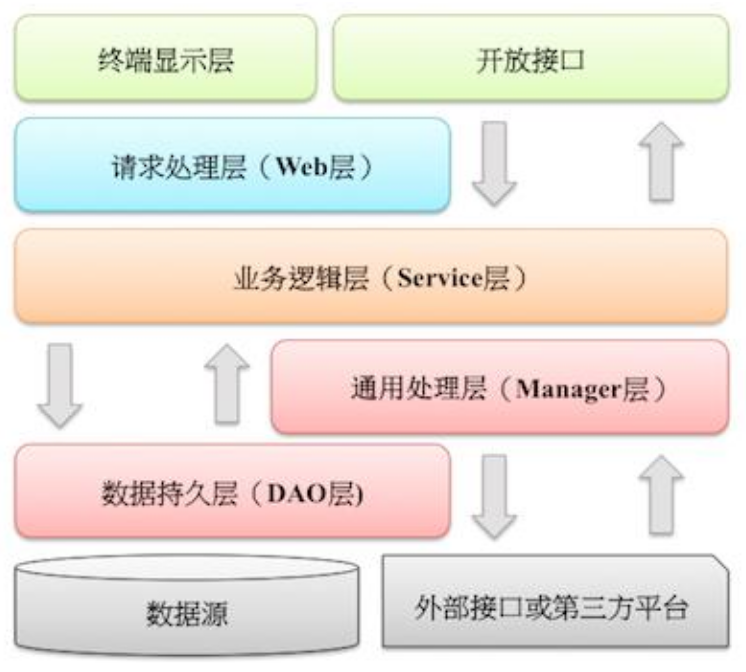

# 六、工程结构

## (一) 应用分层

1. 【推荐】图中默认上层依赖于下层，箭头关系表示可直接依赖，如：开放接口层可以依赖于 Web 层，也可以直接依赖于Service层，依此类推：
    
    
    - 开放接口层：可直接封装Service方法暴露成RPC接口；通过Web封装成http接口；网关控制层等。
    - 终端显示层：各个端的模板渲染并执行显示的层。当前主要是velocity渲染，JS渲染，JSP渲染，移动端展示等。
    - Web层：主要是对访问控制进行转发，各类基本参数校验，或者不复用的业务简单处理等。
    - Service层：相对具体的业务逻辑服务层。
    - Manager层：通用业务处理层，它有如下特征：
       
       1 ） 对第三方平台封装的层，预处理返回结果及转化异常信息。
       
       2 ） 对Service层通用能力的下沉，如缓存方案、中间件通用处理。
       
       3 ） 与DAO层交互，对多个DAO的组合复用。
    - DAO层：数据访问层，与底层 MySQL、Oracle、Hbase、OB 等进行数据交互。
    - 外部接口或第三方平台：包括其它部门 RPC 开放接口，基础平台，其它公司的 HTTP 接口。
2. 【参考】（分层异常处理规约）在DAO层，产生的异常类型有很多，无法用细粒度的异常进行 catch，使用`catch(Exception e)`方式，并`throw new DAOException(e)`，不需要打印日志，因为日志在`Manager/Service`层一定需要捕获并打印到日志文件中去，如果同台服务器再打日志，浪费性能和存储。在Service层出现异常时，必须记录出错日志到磁盘，尽可能带上参数信息，相当于保护案发现场。Manager层与Service同机部署，日志方式与DAO层处理一致，如果是单独部署，则采用与Service一致的处理方式。Web层绝不应该继续往上抛异常，因为已经处于顶层，如果意识到这个异常将导致页面无法正常渲染，那么就应该直接跳转到友好错误页面，尽量加上友好的错误提示信息。开放接口层要将异常处理成错误码和错误信息方式返回。

3. 【参考】分层领域模型规约：
    - `DO（Data Object）`：此对象与数据库表结构一一对应，通过`DAO`层向上传输数据源对象。
    - `DTO（Data Transfer Object）`：数据传输对象，Service或Manager向外传输的对象。
    - `BO（Business Object）`：业务对象，可以由Service层输出的封装业务逻辑的对象。
    - `Query`：数据查询对象，各层接收上层的查询请求。注意超过 `2` 个参数的查询封装，**禁止**使用 `Map` 类来传输。
    - `VO（View Object）`：显示层对象，通常是Web向模板渲染引擎层传输的对象。

## (二) 二方库依赖

1. 【强制】定义GAV遵从以下规则：
    1 ） **GroupID格式**：`com.{公司/BU }.业务线[.子业务线]`，最多 `4` 级。
    ::: warning 说明：
    `{公司/BU}` 例如：alibaba/taobao/tmall/aliexpress等BU一级；子业务线可选。
    :::
    ::: tip 正例：
    `com.taobao.jstorm` 或 `com.alibaba.dubbo.register`
    :::
    2 ） **ArtifactID格式**：`产品线名-模块名`。语义不重复不遗漏，先到中央仓库去查证一下。
    ::: tip 正例：
    `dubbo-client` / `fastjson-api` / `jstorm-tool`
    :::
    3 ） **Version**：详细规定参考下方。
2. 【强制】**二方库版本号命名方式**：`主版本号.次版本号.修订号`
   
    1 ）**主版本号**：产品方向改变，或者大规模API不兼容，或者架构不兼容升级。
   
    2 ）**次版本号**：保持相对兼容性，增加主要功能特性，影响范围极小的API不兼容修改。
   
    3 ）**修订号**：保持完全兼容性，修复BUG、新增次要功能特性等。
    ::: warning 说明：
    注意起始版本号必须为：1.0.0，而不是0.0.1。
    :::
    ::: danger 反例：
    仓库内某二方库版本号从1.0.0.0开始，一直默默“升级”成1.0.0.64，完全失去版本的语义信息。
    :::
3. 【强制】线上应用不要依赖 `SNAPSHOT` 版本（安全包除外）；正式发布的类库必须先去中央仓库进行查证，使 `RELEASE` 版本号有延续性，且版本号不允许覆盖升级。
    ::: warning 说明：
    不依赖 `SNAPSHOT` 版本是保证应用发布的幂等性。另外，也可以加快编译时的打包构建。
    :::
4. 【强制】二方库的新增或升级，保持除功能点之外的其它 `jar` 包仲裁结果不变。如果有改变，必须明确评估和验证。
    ::: warning 说明：
    在升级时，进行 `dependency:resolve` 前后信息比对，如果仲裁结果完全不一致，那么通过 `dependency:tree`命令，找出差异点，进行`<exclude>`排除jar包。
    :::
5. 【强制】二方库里可以定义枚举类型，参数可以使用枚举类型，但是接口返回值不允许使用枚举类型或者包含枚举类型的POJO对象。
6. 【强制】依赖于一个二方库群时，必须定义一个统一的版本变量，避免版本号不一致。
    ::: warning 说明：
    依赖`springframework-core`,`-context`,`-beans`，它们都是同一个版本，可以定义一个变量来保存版本：`${spring.version}`，定义依赖的时候，引用该版本。
    :::
7. 【强制】禁止在子项目的`pom依赖`中出现**相同**的`GroupId`，**相同**的`ArtifactId`，但是**不同**的`Version`。
    ::: warning 说明：
    在本地调试时会使用各子项目指定的版本号，但是合并成一个war，只能有一个版本号出现在最后的lib目录中。曾经出现过线下调试是正确的，发布到线上却出故障的先例。
    :::
8. 【推荐】底层基础技术框架、核心数据管理平台、或近硬件端系统谨慎引入第三方实现。
9. 【推荐】所有pom文件中的依赖声明放在`<dependencies>`语句块中，所有版本仲裁放在 `<dependencyManagement>`语句块中。
    ::: warning 说明：
    `<dependencyManagement>`里只是声明版本，并不实现引入，因此子项目需要显式的声明依赖，version和scope都读取自父pom。而`<dependencies>`所有声明在主pom的`<dependencies>`里的依赖都会自动引入，并默认被所有的子项目继承。
    :::
10. 【推荐】二方库不要有配置项，最低限度不要再增加配置项。
11. 【推荐】不要使用不稳定的工具包或者Utils类。
    ::: warning 说明：
    不稳定指的是提供方无法做到向下兼容，在编译阶段正常，但在运行时产生异常，因此，尽量使用业界稳定的二方工具包。
    :::
12. 【参考】为避免应用二方库的依赖冲突问题，二方库发布者应当遵循以下原则：
    1 ） **精简可控原则** 。移除一切不必要的API和依赖，只包含 Service API、必要的领域模型对象、Utils类、常量、枚举等。如果依赖其它二方库，尽量是provided引入，让二方库使用者去依赖具体版本号；无log具体实现，只依赖日志框架。
    2 ） **稳定可追溯原则** 。每个版本的变化应该被记录，二方库由谁维护，源码在哪里，都需要能方便查到。除非用户主动升级版本，否则公共二方库的行为不应该发生变化。

## (三) 服务器

1. 【推荐】高并发服务器建议调小TCP协议的time_wait超时时间。
    ::: warning 说明：
    操作系统默认 240 秒后，才会关闭处于time_wait状态的连接，在高并发访问下，服务器端会因为处于time_wait的连接数太多，可能无法建立新的连接，所以需要在服务器上调小此等待值。
    :::
    ::: tip 正例：
    在linux服务器上请通过变更/etc/sysctl.conf文件去修改该缺省值（秒）：

    `net.ipv4.tcp_fin_timeout = 30`
    :::
2. 【推荐】调大服务器所支持的最大文件句柄数（File Descriptor，简写为fd）。
    ::: warning 说明：
    主流操作系统的设计是将`TCP/UDP`连接采用与文件一样的方式去管理，即一个连接对应于一个fd。主流的linux服务器默认所支持最大fd数量为 `1024` ，当并发连接数很大时很容易因为fd不足而出现“open too many files”错误，导致新的连接无法建立。建议将linux服务器所支持的最大句柄数调高数倍（与服务器的内存数量相关）。
    :::
3. 【推荐】给`JVM`环境参数设置`-XX:+HeapDumpOnOutOfMemoryError`参数，让`JVM`碰到`OOM`场景时输出`dump`信息。
    ::: warning 说明：
    OOM的发生是有概率的，甚至相隔数月才出现一例，出错时的堆内信息对解决问题非常有帮助。
    :::
4. 【推荐】在线上生产环境，JVM的`Xms`和`Xmx`设置一样大小的内存容量，避免在GC 后调整堆大小带来的压力。
5. 【参考】**服务器内部重定向**必须使用`forward`；**外部重定向**地址必须使用`URL Broker`生成，否则因线上采用`HTTPS`协议而导致浏览器提示“不安全“。此外，还会带来URL维护不一致的问题。

